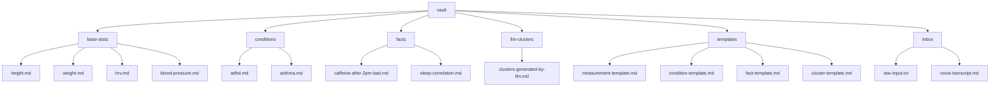

# BENCHMARK.me - Local Health Knowledge Agent

A personal health data agent that ingests, atomizes, links, and clusters your health information within an Obsidian vault.

## System Specifications

- **Model**: Nemotron Super (8B, Q4_K_M)
- **Runtime**: Ollama via Docker
- **Hardware**: Optimized for RTX 5070 (12GB VRAM)
- **Interface**: Called via API by Obsidian plugin or CLI tool

## Vault Structure



## Installation

### Prerequisites

1. [Docker Desktop](https://www.docker.com/products/docker-desktop) (with WSL2 backend)
2. [NVIDIA Container Toolkit](https://docs.nvidia.com/datacenter/cloud-native/container-toolkit/install-guide.html) (for GPU acceleration)
3. PowerShell 5.1+ (built into Windows)

### Quick Start

1. Clone or download this repository
2. Run the installation script as administrator:

   ```powershell
   Set-ExecutionPolicy -Scope Process -ExecutionPolicy Bypass
   .\scripts\install-local-llm.ps1
   ```

3. The script will:
   - Install/pull Ollama Docker image
   - Set up persistent storage volume
   - Start Ollama container with GPU support (if NVIDIA Container Toolkit is installed)
   - Pull the Nemotron Super 8B Q4_K_M model
   - Verify the installation

### Manual Installation Steps

If you prefer to install manually, follow these steps:

#### 1. Install Docker Desktop

- Download from [docker.com](https://www.docker.com/products/docker-desktop)
- Install with WSL2 backend enabled

#### 2. Install NVIDIA Container Toolkit (for GPU support)

```powershell
# In WSL2 Ubuntu terminal:
curl -s -L https://nvidia.github.io/nvidia-docker/gpgkey | sudo apt-key add -
distribution=$(. /etc/os-release;echo $ID$VERSION_ID)
curl -s -L https://nvidia.github.io/nvidia-docker/$distribution/nvidia-docker.list | sudo tee /etc/apt/sources.list.d/nvidia-docker.list
sudo apt-get update
sudo apt-get install -y nvidia-docker2
sudo systemctl restart docker
```

#### 3. Pull and Run Ollama

```powershell
# Create volume for persistent storage
docker volume create ollama

# Run Ollama container
docker run -d --name ollama -p 11434:11434 -v ollama:/root/.ollama --gpus all --restart unless-stopped ollama/ollama

# Wait for container to start (~10 seconds)
# Then pull the model
docker exec ollama ollama pull nemotron-super:8b-q4_K_M
```

## Usage

### Starting the System

The Ollama container is set to auto-start unless stopped. To manually control it:

```powershell
# Start the container
docker start ollama

# Stop the container
docker stop ollama

# View logs
docker logs -f ollama
```

### Using with BENCHMARK.me

1. Place raw health data in `./vault/inbox/` (text files, voice transcripts, etc.)
2. The BENCHMARK.me agent (via Obsidian plugin or CLI) will:
   - Ingest the data into appropriate vault files
   - Link related notes
   - Cluster patterns over time
   - Validate facts against measurements
   - Answer queries about your health data

### API Endpoint

The local LLM is available at: `http://localhost:11434`

Example API call:

```powershell
Invoke-RestMethod -Uri "http://localhost:11434/api/generate" -Method Post -Body (@{
    model = "nemotron-super:8b-q4_K_M"
    prompt = "What is the capital of France?"
    stream = $false
} | ConvertTo-Json) -ContentType "application/json"
```

## Model Information

- **Model**: Nemotron Super 8B Q4_K_M
- **Type**: LLM for text generation
- **Quantization**: Q4_K_M (4-bit, high quality)
- **Size**: ~4.9 GB
- **Capabilities**: Excellent for reasoning, pattern recognition, and language understanding
- **Optimization**: Designed to run efficiently on consumer GPUs like the RTX 5070

## Troubleshooting

### Common Issues

1. **Docker not found**
   - Ensure Docker Desktop is installed and running
   - Try restarting Docker Desktop

2. **GPU not detected**
   - Verify NVIDIA Container Toolkit is installed
   - Check that you're using the WSL2 backend in Docker Desktop
   - Run `docker info` and look for "nvidia" in the output

3. **Model pull fails**
   - Check your internet connection
   - Try alternative model names: `nemotron-super:8b` or `nemotron-super:latest`
   - The model name might vary in the Ollama library

4. **Container won't start**
   - Check for port conflicts: `docker ps -a`
   - Try removing existing container: `docker rm -f ollama`
   - Check logs: `docker logs ollama`

### Getting Help

- Ollama documentation: <https://github.com/ollama/ollama>
- Docker troubleshooting: <https://docs.docker.com/desktop/troubleshoot/>
- NVIDIA Container Toolkit: <https://docs.nvidia.com/datacenter/cloud-native/container-toolkit/>

## Data Privacy

⚠️ **Important**: All your health data remains strictly local:

- Data is stored only in your `./vault/` directory
- The LLM runs entirely on your local machine (via Docker)
- No data leaves your computer unless you explicitly share it
- The model weights are downloaded once and stored locally

## Customization

### Changing the Model

To use a different model, modify the script:

```powershell
# In scripts/install-local-llm.ps1, change this line:
docker exec ollama ollama pull nemotron-super:8b-q4_K_M
# To:
docker exec ollama ollama pull your-preferred-model:tag
```

### Adjusting Container Resources

To limit GPU memory usage (useful if running other GPU applications):

```powershell
# Add to docker run command:
--gpus '"device=0,capabilities=compute,utility"' --memory=8g
```

## License

This project is provided as-is for personal health data management.
Consult healthcare professionals for medical advice - this tool is for data organization and pattern recognition only.

---

*BENCHMARK.me - Empowering personal health insights through local AI*
